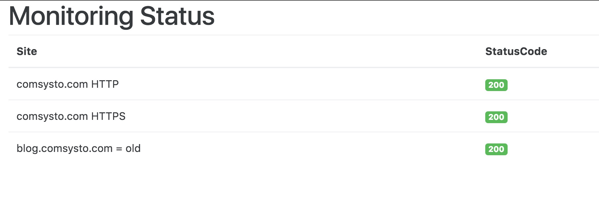

# comsysto-monitoring-app

Monitors some of comsysto's infrastructure.

## Prerequisites

Oracle Java JDK 8 needs to be installed and on PATH.

## Run

```
./gradlew bootRun
```

open http://localhost:8080/

## Build and Run

```
./gradlew build
```

Artifact created is `build/libs/comsysto-monitoring-app.war`

You can run embedded tomcat with:

```
java -jar build/libs/comsysto-monitoring-app.war
```

OR deploy the war file to a running Tomcat

## Description

The App does HTTP Requests to some URLs and displays the Status Code



See `HomeController.java` for config.

